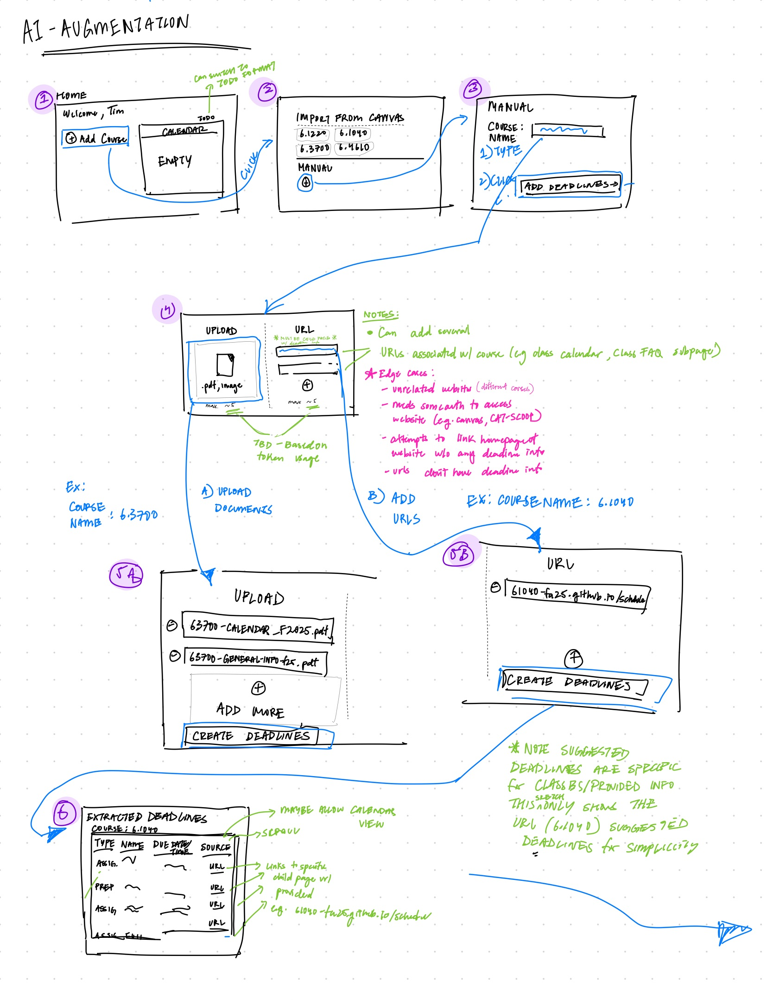
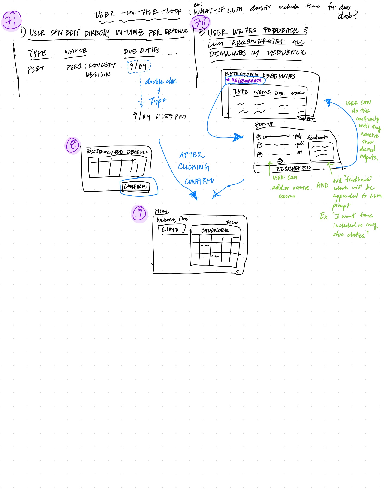

# Assignment 3

## Table of Contents

1. [Augment the design of a concept](#1-augment-the-design-of-a-concept)
2. [Design the User Interaction](#2-design-the-user-interaction)
3. [Implement your concept](#3-implement-your-concept)
4. [Explore richer test cases and prompts](#4-explore-richer-test-cases-and-prompts)
5. [Add validators to your code](#5-add-validators-to-your-code)
6. [Appendix: Prompt Engineering Journey/Learnings](#appendix-prompt-engineering-journeylearnings)

---

## 1) Augment the design of a concept

> Deliverable: your original concept specification (unchanged), and an AI-augmented version.

**Original Concept Specification**

```
concept ParsedDeadlineSuggestions
purpose represent auto-parsed deadlines from Canvas
principle each suggestion comes from Canvas and can be confirmed into a real deadline
state
  a set of ParsedDeadlineSuggestions with
    an optional canvasMetadata String
    a title String
    a due DateTime
    a source of CANVAS
    a optional confirmed Flag
actions
  parseFromCanvas (user: User)
    effect parses fetched Canvas data and creates suggestions
  confirm (suggestion: ParsedDeadlineSuggestion): (course: Course, title: String, due: DateTime, source: CANVAS, addedBy: User)
    effect marks a suggestion as confirmed and extracts data for a real deadline

```

**AI-augmented Version**

```
concept ParsedDeadlineSuggestions

purpose
    represent extracted deadline candidates from documents, images, web pages, or Canvas; optionally AI-augmented

principle
    suggestions are produced via an LLM from uploaded files, web pages, or Canvas data;
    users confirm suggestions before they become official deadlines

state
    a set of ParsedDeadlineSuggestion with
        an optional UploadedDocument
        an optional canvasMetadata String
        an optional websiteUrl String
        a title String
        a due DateTime
        a source of SYLLABUS or IMAGE or WEBSITE or CANVAS
        an optional confirmed Boolean
        an optional confidence Number (0.0–1.0)
        an optional extractionMethod of CANVAS_JSON or LLM
        an optional provenance String
        an optional warnings set of String

    a set of ExtractionConfig with
        a modelVersion String
        a basePromptTemplate String
        a maxTokens Number
        a temperature Number
        a timezone String

actions

    parseFromCanvas(user: User): List<ParsedDeadlineSuggestion>
        requires user has valid Canvas connection
        effect parses assignment JSON directly from Canvas API
               sets extractionMethod = CANVAS_JSON, source = CANVAS

    llmExtractFromDocument(document: UploadedDocument, config: ExtractionConfig): List<ParsedDeadlineSuggestion>
        requires document contains extractable text or image content
        effect uses LLM to extract structured suggestions from document
               sets extractionMethod = LLM, confidence, provenance

    llmExtractFromMultipleDocuments(documents: List<UploadedDocument>, config: ExtractionConfig): List<ParsedDeadlineSuggestion>
        requires all documents contain extractable content
        effect sends ALL documents to LLM in SINGLE request
               enables LLM to cross-reference information across documents
               (e.g., combine dates from PDF calendar with times from PNG syllabus)
               sets extractionMethod = LLM, confidence, provenance with multi-source attribution

    llmExtractFromWebsite(url: String, config: ExtractionConfig): List<ParsedDeadlineSuggestion>
        requires url is reachable, non-empty, and starts with https://
        effect uses LLM to parse website content into deadline suggestions
               sets extractionMethod = LLM, provenance, confidence

    refineWithFeedback(suggestion: ParsedDeadlineSuggestion, feedback: String, config: ExtractionConfig): ParsedDeadlineSuggestion
        requires suggestion exists and feedback is non-empty
        effect re-prompts LLM using user feedback to refine fields
               updates title, due, warnings, or confidence

    validateSuggestions(source: UploadedDocument or String)
        requires source is non-null and has suggestions
        effect applies validation logic (e.g., duplicate detection, implausible dates, hallucination detection)
               adds warnings or raises error if issues are detected

    confirm(suggestion: ParsedDeadlineSuggestion): (course: Course, title: String, due: DateTime, source: SYLLABUS or IMAGE or WEBSITE or CANVAS, addedBy: User)
        requires suggestion is not already confirmed and has valid title and due
        effect marks suggestion as confirmed
               emits canonical data to Deadlines.create
```

---

## 2) Design the User Interaction

> Deliverable: some annotated sketches of user interactions and a brief user journey.

**Annotated Sketches**




**Brief User Journey**

**Title: Tim manages deadlines across multiple MIT classes with AI assistance**

Tim, an MIT junior juggling multiple Course 6 classes, needs to organize deadlines for both 6.3700 and 6.1040. He starts by uploading two PDF documents for 6.3700 to DueStack.

**Step 1: Uploading 6.3700 Course Materials**
Tim uploads `63700-Calendar_F2025-v1.pdf` containing a table of all assignments and exams with their due dates (but no specific times), and `63700-General-Info-f25-v1.png` with timing specifications. He selects "Use AI Parsing" for both documents. The system uses `llmExtractFromMultipleDocuments` to send both documents to the LLM in a single request, allowing the LLM to cross-reference information across documents while analyzing them. The calendar PDF provides assignment due dates (e.g., "PS1 Due Wednesday, September 17th") while the general info PNG provides timing specifications (e.g., "Homework normally due at 11:59pm on Wednesdays").

**Step 2: Intelligent Cross-referencing and Time Integration**
Because both documents were sent together in one request, the LLM immediately correlates the problem set due dates from the calendar with the timing specifications from the general info document. It recognizes that all problem sets follow the Wednesday 11:59 PM pattern, resulting in complete deadline suggestions in a single extraction:

- "PS1 Due (L1) – Wednesday, September 17th, 11:59 PM"
- "PS2 Due (L2, L3) – Wednesday, September 24th, 11:59 PM"
- "PS3 Due (L4, L5) – Wednesday, October 1st, 11:59 PM"
- "PS4 Due (L6, L7) – Wednesday, October 8th, 11:59 PM"
- "PS5 Due (L8, L9) – Wednesday, October 15th, 11:59 PM"

**Step 2.5: Manual Correction of LLM Error**
Tim reviews the suggestions and notices that the LLM misread one entry from the calendar. The system shows "PS3 Due (L4, L5) – Wednesday, October 1st" but Tim knows from the calendar that PS3 is actually due on Wednesday, October 2nd. He manually edits the date field for PS3 directly in the interface, changing "October 1st" to "October 2nd". The system applies this change immediately without calling the LLM again:

- "PS3 Due (L4, L5) – Wednesday, October 2nd, 11:59 PM" ✅ (Manually corrected)

The system validates that the combined date-time information is reasonable and flags any potential conflicts or missing timing information.

**Step 3: Website Extraction for 6.1040**
Tim then uses the website extraction feature to pull deadlines directly from the 6.1040 course website, specifically the URL pointing to the schedule: https://61040-fa25.github.io/schedule. The system uses `llmExtractFromWebsite` to parse the HTML table, but initially only extracts dates without precise times:

- "Assignment 1: Problem Framing – September 7"
- "Assignment 2: Functional Design – September 28"
- "Pset 1: Concept Design – September 14"
- "Assignment 3: An AI Augmented Concept – October 5"
- "Assignment 4: Backend MVP – October 12"
- "Assignment 5: Backend Complete – October 19"
- "Assignment 6: Full Stack MVP – October 26"
- "Team 5: Full Demo – December 7"

**Step 4: Review and Refinement**
Tim reviews all extracted suggestions and notices they're missing specific times. He selects all the suggestions and provides feedback: "All assignments in 6.1040 are due at 11:59 PM. Please add the specific times to all deadline suggestions." The system uses `refineWithFeedback` to update all suggestions with the correct timing:

- "Assignment 1: Problem Framing – September 7, 11:59 PM"
- "Assignment 2: Functional Design – September 28, 11:59 PM"
- "Pset 1: Concept Design – September 14, 11:59 PM"
- "Assignment 3: An AI Augmented Concept – October 5, 11:59 PM"
- "Assignment 4: Backend MVP – October 12, 11:59 PM"
- "Assignment 5: Backend Complete – October 19, 11:59 PM"
- "Assignment 6: Full Stack MVP – October 26, 11:59 PM"
- "Team 5: Full Demo – December 7, 11:59 PM"

**Step 5: Confirmation and Integration**
Once satisfied, Tim confirms all high-confidence suggestions with a single click. DueStack calls `ParsedDeadlineSuggestions.confirm` for each suggestion, feeding the data into his calendar system. The deadlines are now organized by course and sorted chronologically. Tim went from scattered PDFs and web pages to a complete, organized deadline system across two courses, with AI handling the tedious parsing work while he maintained control over the final decisions.

---

## 3) Implement your concept

> Deliverable: a code repo containing (1) your augmented concept, (2) a driver to execute test cases, and (3) the concept specification in a separate file.

### (1) Augmented Concept Implementation

**Main Concept File**: [parsed-deadline-suggestions.ts](parsed-deadline-suggestions.ts)

The core `ParsedDeadlineSuggestions` class implements all actions from the concept specification, including:

- LLM-based extraction from documents, websites, and Canvas
- Multi-document cross-referencing in single LLM requests
- User feedback refinement
- Manual editing capabilities
- Validation and confirmation workflows

**Supporting Files**:

- [gemini-llm.ts](gemini-llm.ts) - LLM integration with Gemini API
- [parsed-deadline-state.ts](parsed-deadline-state.ts) - State management
- [parsed-deadline-validators.ts](parsed-deadline-validators.ts) - Validation logic
- [parsed-deadline-prompts.ts](parsed-deadline-prompts.ts) - Prompt creation utilities
- [parsed-deadline-editing.ts](parsed-deadline-editing.ts) - Manual editing utilities

### Implementation Highlights

**Structured Output with JSON Schema**

The implementation uses [Gemini's structured output capabilities](https://ai.google.dev/gemini-api/docs/structured-output) for reliable JSON responses:

```typescript
generationConfig: {
  responseMimeType: "application/json",
  responseSchema: {
    type: SchemaType.OBJECT,
    properties: {
      suggestions: {
        type: SchemaType.ARRAY,
        items: {
          type: SchemaType.OBJECT,
          properties: {
            title: { type: SchemaType.STRING },
            due: { type: SchemaType.STRING, format: "date-time" },
            confidence: { type: SchemaType.NUMBER },
            provenance: { type: SchemaType.STRING }
          },
          required: ["title", "due", "confidence", "provenance"]
        }
      }
    },
    required: ["suggestions"]
  }
}
```

Benefits: Eliminates JSON parsing errors, ensures consistent output format, reduces hallucination through schema constraints.

**Multimodal LLM Integration**

Direct processing of images, PDFs, and URLs using Gemini's native multimodal capabilities:

- `executeLLMWithImage()`: Processes images directly as base64-encoded data
- `executeLLMWithPDF()`: Handles PDF files up to 20MB with inline data
- `executeLLMWithURL()`: Fetches and analyzes web content directly
- `executeLLMWithMultipleDocuments()`: Sends multiple documents in single request for cross-referencing

**Prompt Architecture**

For Document/Image Extraction: Prompt is sent exactly as provided from test files (no augmentation).

For Web Extraction: `gemini-llm.ts` adds timezone instructions and web content to ensure consistency:

```typescript
const fullPrompt = `${prompt}

Website URL: ${url}

CRITICAL TIMEZONE INFORMATION:
- All times in the website are in America/New_York timezone (Eastern Time)
- Eastern Time uses DAYLIGHT SAVING TIME:
  * September-October 2025: Use EDT (UTC-4) → format: -04:00
  * November 2-December 2025: Use EST (UTC-5) → format: -05:00

Website HTML Content:
${webContent}`;
```

### (2) Driver to Execute Test Cases

**Test Driver**: [parsed-deadline-suggestions-tests.ts](parsed-deadline-suggestions-tests.ts)

Executes test cases covering all concept actions:

1. **Canvas Integration** (`npm run canvas`) - Parse assignment data from Canvas API
2. **LLM Document Extraction** (`npm run llm-doc`) - Extract from text files
3. **LLM Website Extraction** (`npm run llm-web`) - Parse web pages
4. **LLM Refinement** (`npm run llm-refine`) - Improve with user feedback
5. **Manual Editing** (`npm run manual`) - Direct editing without LLM
6. **Multi-Document Extraction** (`npm run llm-pdf-png`) - Cross-reference multiple documents
7. **LLM Connection Testing** (`npm run llm-test`) - API connectivity

**Challenging Scenarios**: [parsed-deadline-scenarios.ts](parsed-deadline-scenarios.ts)

Three complete user-LLM interaction sequences (`npm run scenarios`):

- Ambiguous academic language handling
- Date format interpretation
- Conflict resolution

**Running All Tests**:

```bash
npm start              # Run all test cases
npm run scenarios      # Run three challenging scenarios
```

### (3) Concept Specification

**Specification File**: [parsed-deadline-suggestions.spec](parsed-deadline-suggestions.spec)

---

## 4) Explore richer test cases and prompts

> Deliverable: 3 test cases, each comprising a full scenario that involves a sequence of user actions followed by one of more LLM-based actions, and 3 prompt variants motivated by the test cases. A short paragraph for each of your experiments describing: what your approach was; what worked, what went wrong, what issues remain.

### Running These Tests

```bash
# Run all three challenging scenarios (full user-LLM interaction sequences)
npm run scenarios       # All three scenarios with complete user workflows
```

The three test scenarios are implemented in [parsed-deadline-scenarios.ts](parsed-deadline-scenarios.ts), each demonstrating a complete sequence of user actions followed by LLM-based actions.

---

### Test Scenario 1: Ambiguous Academic Language

**Full Scenario**: A student uploads a course syllabus containing vague academic terms ("TBD", "End of semester", "Soon", "Later in the course"). The system attempts LLM extraction with different prompt variants. The student reviews results, notices some dates appear hallucinated (e.g., "Soon" becoming a specific date), and provides feedback to refine the extraction. The system re-extracts with improved prompts, reducing hallucinations by rejecting vague terms.

#### Initial Prompt (Variant A)

```
You are an expert at extracting deadline information from academic documents.
Extract all assignment deadlines, project due dates, and important dates from the provided content.
Return your response as a JSON object with this exact structure:
{
  "suggestions": [
    {
      "title": "Assignment or project name",
      "due": "YYYY-MM-DDTHH:mm:ssZ",
      "confidence": 0.0-1.0,
      "provenance": "Brief description of where this was found"
    }
  ]
}
```

**What Worked**: Successfully extracted clear dates like "October 15th"

**What Went Wrong**: Failed to interpret relative dates like "next Friday" and "end of semester"

**Issues Remaining**: No context awareness for relative date references

#### Improved Prompt (Variant B)

```
You are an expert at extracting deadline information from academic documents.
Extract all assignment deadlines, project due dates, and important dates from the provided content.

IMPORTANT: For relative dates like "next Friday", "end of semester", "due next week":
- Use the current date as context: ${new Date().toISOString().split('T')[0]}
- Assume "end of semester" means December 15th of the current year
- Convert "next Friday" to the upcoming Friday
- When uncertain about relative dates, use lower confidence scores (0.3-0.6)

Return your response as a JSON object with this exact structure:
{
  "suggestions": [
    {
      "title": "Assignment or project name",
      "due": "YYYY-MM-DDTHH:mm:ssZ",
      "confidence": 0.0-1.0,
      "provenance": "Brief description of where this was found"
    }
  ]
}
```

**Improvements**: Added context awareness and specific handling for relative dates

**Remaining Issues**: Still struggles with context-dependent interpretations

#### Final Prompt (Variant C)

```
You are an expert at extracting deadline information from academic documents with academic calendar context.

CONTEXT:
- Current Date: ${new Date().toISOString().split('T')[0]}
- Academic Year: ${new Date().getFullYear()}-${new Date().getFullYear() + 1}
- Fall Semester: September-December, Spring Semester: January-May

EXTRACTION RULES:
1. For explicit dates: Use exact date with high confidence (0.8+)
2. For relative dates:
   - "next Friday" = upcoming Friday
   - "end of semester" = December 15th (Fall) or May 15th (Spring)
   - "next week" = 7 days from current date
3. For ambiguous dates: Use lower confidence (0.3-0.6) and note uncertainty

Return your response as a JSON object with this exact structure:
{
  "suggestions": [
    {
      "title": "Assignment or project name",
      "due": "YYYY-MM-DDTHH:mm:ssZ",
      "confidence": 0.0-1.0,
      "provenance": "Brief description including any assumptions made"
    }
  ]
}
```

**Approach & Findings**: Generic prompts hallucinated dates for vague terms like "soon" and "later." Adding academic calendar context helped with relative dates. Best solution: conservative prompting with explicit rejection rules. Trade-off: miss some valid deadlines to avoid hallucinations.

---

### Test Scenario 2: MIT Course Date Formats

**Full Scenario**: A student uploads a course document with dates in multiple formats ("10/15/2024", "15th October 2024", "Next Monday"). Initial LLM extraction misinterprets some formats (treats MM/DD as DD/MM). The student notices incorrect dates and manually corrects one example. The system learns the correct format context and re-extracts all dates. Student validates corrections and confirms all deadlines.

#### Initial Prompt (Variant A)

```
Extract all assignment deadlines from the provided content.
Return dates in ISO format (YYYY-MM-DDTHH:mm:ssZ).
```

**What Worked**: Successfully parsed standard formats like "10/15/2024"

**What Went Wrong**: Failed to parse written-out dates like "15th October 2024"

**Issues Remaining**: Inconsistent handling of different MIT course date formats

#### Improved Prompt (Variant B)

```
Extract all assignment deadlines from the provided content.

MIT COURSE DATE FORMAT HANDLING:
- Standard formats: 10/15/2024, 10-15-2024, Oct 15 2024
- Written formats: October 15th, 15th October 2024, Oct fifteenth
- Relative dates: "Next Monday", "Due Wednesday", "End of week"
- All dates should be converted to ISO format: YYYY-MM-DDTHH:mm:ssZ
- Default time to 23:59:59 if not specified

Return your response as a JSON object with this exact structure:
{
  "suggestions": [
    {
      "title": "Assignment or project name",
      "due": "YYYY-MM-DDTHH:mm:ssZ",
      "confidence": 0.0-1.0,
      "provenance": "Brief description of where this was found"
    }
  ]
}
```

**Improvements**: Added specific handling for MIT course date formats

**Remaining Issues**: Still struggles with ordinal numbers (fifteenth, 15th)

#### Final Prompt (Variant C)

```
Extract all assignment deadlines from the provided content.

COMPREHENSIVE MIT COURSE DATE PARSING:
1. Numeric formats: 10/15/2024, 10-15-2024 (assume MM/DD/YYYY for MIT context)
2. Abbreviated formats: Oct 15, Oct 15 2024, 15 Oct 2024
3. Full formats: October 15, October 15 2024, 15 October 2024
4. Ordinal formats: October 15th, Oct fifteenth, 15th October 2024
5. Relative dates: "Next Monday", "Due Wednesday", "End of week", "In 2 weeks"
6. Written ordinals: fifteenth = 15th, first = 1st, second = 2nd, etc.

CONVERSION RULES:
- All dates → ISO format: YYYY-MM-DDTHH:mm:ssZ
- Default time: 23:59:59 (end of day)
- Default year: current year if not specified
- High confidence (0.8+) for clear dates, lower (0.5-0.7) for ambiguous ones

Return your response as a JSON object with this exact structure:
{
  "suggestions": [
    {
      "title": "Assignment or project name",
      "due": "YYYY-MM-DDTHH:mm:ssZ",
      "confidence": 0.0-1.0,
      "provenance": "Brief description of parsing method used"
    }
  ]
}
```

**Approach & Findings**: Simple prompts misinterpret ambiguous formats (DD/MM vs MM/DD). Explicit format recognition rules improved accuracy. Conservative rejection of ambiguous formats is most reliable but misses valid dates. Comprehensive format specifications balance accuracy and coverage.

---

### Test Scenario 3: Context-Dependent Deadline Interpretation

**Full Scenario**: A student uploads a document mentioning "PS1 due Oct 15" early in the document and "Problem Set 1 deadline: Oct 20" later. Initial LLM extraction creates two duplicate entries. Student notices the conflict and provides feedback: "PS1 and Problem Set 1 are the same assignment." System re-extracts with conflict resolution logic, identifies later mention as authoritative, and creates single entry for Oct 20. Student confirms the resolved deadline.

#### Initial Prompt (Variant A)

```
Extract all assignment deadlines from the provided content.
Return your response as a JSON object.
```

**What Worked**: Extracted all mentioned dates

**What Went Wrong**: Created duplicate suggestions without detecting conflicts

**Issues Remaining**: No conflict detection or resolution

#### Improved Prompt (Variant B)

```
Extract all assignment deadlines from the provided content.

CONFLICT DETECTION:
- If the same assignment appears with different dates, note the conflict
- Include all dates found but mark confidence lower (0.4-0.6)
- Add provenance explaining the conflict

Return your response as a JSON object with this exact structure:
{
  "suggestions": [
    {
      "title": "Assignment or project name",
      "due": "YYYY-MM-DDTHH:mm:ssZ",
      "confidence": 0.0-1.0,
      "provenance": "Brief description including any conflicts found"
    }
  ]
}
```

**Improvements**: Added conflict detection with lower confidence scores

**Remaining Issues**: Doesn't provide resolution strategies

#### Final Prompt (Variant C)

```
Extract all assignment deadlines from the provided content.

CONFLICT RESOLUTION STRATEGY:
1. IDENTIFY: Look for assignments mentioned multiple times with different dates
2. ANALYZE: Determine which date is more authoritative (later in document, more specific format)
3. RESOLVE: Create single suggestion with the most likely correct date
4. DOCUMENT: Note all conflicting dates in provenance

RESOLUTION RULES:
- Later mentions typically override earlier ones
- More specific dates (with time) override vague ones
- Official-looking sections (syllabus, course schedule) override informal mentions
- If uncertain, use lower confidence (0.4-0.6) and note all dates found

Return your response as a JSON object with this exact structure:
{
  "suggestions": [
    {
      "title": "Assignment or project name",
      "due": "YYYY-MM-DDTHH:mm:ssZ",
      "confidence": 0.0-1.0,
      "provenance": "Brief description including conflict resolution reasoning"
    }
  ]
}
```

**Approach & Findings**: Basic prompts created duplicate suggestions for conflicting dates. Conflict detection with lower confidence helped. Best results: explicit resolution strategies with authority rules (later mentions override earlier, specific dates override vague). Domain knowledge and explicit rules essential for handling conflicts.

---

## 5) Add validators to your code.

> Deliverable: A brief paragraph describing 3 plausible issues, and corresponding validators in your code.

The validators in [parsed-deadline-validators.ts](parsed-deadline-validators.ts) catch three categories of realistic LLM failures in deadline extraction:

### **1. LLM Response Structure Validation**

**Issue**: LLMs may return malformed JSON, missing required fields, or invalid data types that break the application.

**Validator**: `validateLLMResponse(response: any, source: string)` in lines 21-98 checks for:

- Valid JSON object structure
- Required `suggestions` array exists and is an array
- Each suggestion has required fields: `title` (string), `due` (valid ISO date), `confidence` (0.0-1.0), `provenance` (string)
- Date strings can be parsed into valid Date objects
- Confidence values are within valid range

Throws exceptions for critical structural failures that would break the application.

### **2. Academic Calendar Logic Validation**

**Issue**: LLMs may generate unrealistic deadlines that violate academic calendar conventions, suggesting times when assignments are never actually due.

**Validator**: `validateAcademicCalendarLogic(suggestion, issues)` in lines 187-229 checks for:

- Weekend deadlines (day 0 or 6) - unusual for academic assignments
- Very early morning deadlines (before 6 AM) - unusual for academic assignments
- Very late evening deadlines (after 11 PM) - unusual for academic assignments

Adds warnings to suggestions for user review rather than rejecting them outright.

### **3. LLM Hallucination Detection**

**Issue**: LLMs may hallucinate specific dates for vague terms, create impossible date combinations, or show suspiciously high confidence on ambiguous input.

**Validator**: `validateForHallucination(suggestion, issues)` in lines 238-291 detects:

- High confidence (>0.7) on vague terms like "TBD", "soon", "later", "eventually", "sometime"
- Deadlines less than 1 day from now (suspiciously close)
- Dates in the past or more than 1 year in the future

Adds warnings to help users identify potentially hallucinated content.

**Main Validator Integration**: `validateSuggestions(suggestions, source, allSuggestions)` in lines 101-178 orchestrates all validation:

- Checks for past dates and dates too far in future
- Detects duplicate titles across all suggestions
- Flags low confidence scores (<0.3)
- Calls `validateAcademicCalendarLogic()` and `validateForHallucination()` for each suggestion
- Logs all issues to console and adds warnings to suggestion objects

**Validator Usage**: All validators are automatically called during extraction:

- `llmExtractFromDocument()` → `validateLLMResponse()` → `validateSuggestions()`
- `llmExtractFromWebsite()` → `validateLLMResponse()` → `validateSuggestions()`
- `refineWithFeedback()` → `validateLLMResponse()` → `validateSuggestions()`

**Error Handling Strategy**: Critical structural errors throw exceptions (malformed JSON, missing required fields), while domain logic violations and potential hallucinations add warnings to suggestions, allowing the system to continue with user review rather than failing completely.

---

## Appendix: Prompt Engineering Journey/Learnings

This section documents the precise prompts, failures, and solutions.

#### **Prompt Architecture**

- **Document/Image Extraction**: Prompts sent exactly as provided from test files (no augmentation)
- **Web Extraction**: `gemini-llm.ts` adds timezone instructions and web content to base prompt to ensure consistency

---

#### **Issue 1: Timezone and Daylight Saving Time**

**Problem**: LLM outputted `-05:00` (EST) for October dates when it should be `-04:00` (EDT).

**Failed Approach**: Generic "EST" instruction - LLM applied EST year-round, ignoring DST transitions.

**Solution**: Explicit month-specific DST instructions with examples:

- "Sep-Oct 2025: EDT (UTC-4) → -04:00"
- "Nov-Dec 2025: EST (UTC-5) → -05:00"
- Examples: `2025-09-07T23:59:00-04:00`

**Additional Fix**: JavaScript display used `toLocaleTimeString("en-US", { timeZone: "America/New_York" })` to avoid system timezone conversion.

---

#### **Issue 2: Web Extraction Strategy**

**Problem**: Need to extract deadlines from course website URLs.

**Failed Approach**: Google Search grounding - returned generic search results about "deadlines" instead of actual page content. Google Search grounding is for general queries, not specific URL content extraction.

**Solution**: Direct HTTP/HTTPS fetching - fetch actual HTML content and send to LLM. LLM can then parse structured data (tables, lists) to extract specific deadlines.

---

#### **Issue 3: Multi-Document Cross-Referencing**

**Problem**: Course materials split information (dates in PDF, times in PNG).

**Failed Approach**: Separate requests - LLM has no context across documents, user must manually combine dates + times, multiple API calls.

**Solution**: Single multi-document request - send all documents to LLM in one call. Prompt explicitly instructs LLM to "cross-reference information from BOTH documents" and combine intelligently. Result: LLM automatically synthesizes "PS1 due Sept 17" + "homework at 11:59 PM" → "PS1 due Sept 17, 11:59 PM".

#### **Key Learnings**

1. **Be Specific**: Detailed instructions beat general guidelines ("Sep-Oct: -04:00" not "EST")
2. **Use Examples**: Show exact formatting (`2025-09-07T23:59:00-04:00`)
3. **Fetch, Don't Search**: For URLs, fetch content directly rather than using search APIs
4. **Cross-Reference Explicitly**: Tell LLM to "combine" or "cross-reference" for multiple documents
5. **Preserve, Don't Convert**: Instruct LLM to preserve original times, not convert timezones

---
